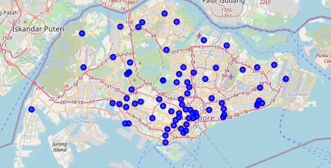

# Machine Learning with Python Capstone Project

## Website Link:

<a href="https://www.coursera.org/professional-certificates/ibm-data-science" target="_blank">IBM Data Science Professional Certificate</a>

## About this Professional Certificate

Data Science has been ranked as one of the hottest professions and the demand for data practitioners is booming. This Professional Certificate from IBM is intended for anyone interested in developing skills and experience to pursue a career in Data Science or Machine Learning.

This program consists of 9 courses providing you with latest job-ready skills and techniques covering a wide array of data science topics including: open source tools and libraries, methodologies, Python, databases, SQL, data visualization, data analysis, and machine learning. You will practice hands-on in the IBM Cloud using real data science tools and real-world data sets.

It is a myth that to become a data scientist you need a Ph.D. This Professional Certificate is suitable for anyone who has some computer skills and a passion for self-learning. No prior computer science or programming knowledge is necessary. We start small, re-enforce applied learning, and build up to more complex topics.

Upon successfully completing these courses you will have done several hands-on assignments and built a portfolio of data science projects to provide you with the confidence to plunge into an exciting profession in Data Science. In addition to earning a Professional Certificate from Coursera, you will also receive a digital Badge from IBM recognizing your proficiency in Data Science.

## Applied Learning Project

This professional certificate has a strong emphasis on applied learning. Except for the first course, all other courses include a series of hands-on labs and are performed in the IBM Cloud (without any cost to you). Throughout this Professional Certificate you are exposed to a series of tools, libraries, cloud services, datasets, algorithms, assignments and projects that will provide you with practical skills with applicability to real jobs that employers value, including:

**Tools**: Jupyter / JupyterLab, Zeppelin notebooks, R Studio, and Watson Studio

**Libraries**: Pandas, NumPy, Matplotlib, Seaborn, Folium, ipython-sql, Scikit-learn, ScipPy, etc.

**Projects**: random album generator, predict housing prices, best classifier model, battle of neighborhoods

## Takeaways 

:heavy_check_mark: Create and access a database instance on cloud

:heavy_check_mark: Write basic SQL statements: CREATE, DROP, SELECT, INSERT, UPDATE, DELETE

:heavy_check_mark: Filter, sort, group results, use built-in functions, access multiple tables

:heavy_check_mark: Access databases from Jupyter using Python and work with real world datasets